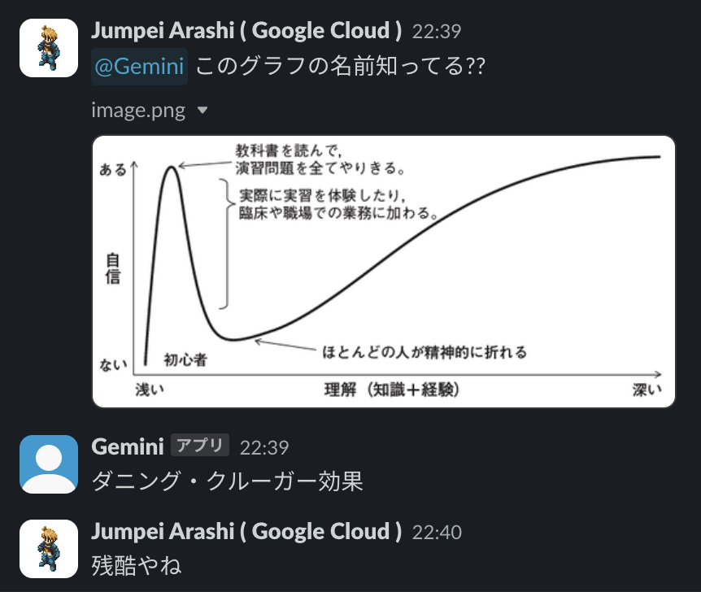

# Gemini slackbot example

This is Gemini Pro integrated slack (bolt JavaScript framework) sample app. Users can have a conversation with Gemini.

## One Click Deploy Button

### required environment variables

- SLACK_SIGNING_SECRET
  - to deploy your slack workspace
- SLACK_OAUTH2_BOT_TOKEN
  - to deploy your slack workspace
- GCP_PROJECT
  - VertexAI client needs GCP_PROJECT name ( not project number )
- GCP_REGION
  - Gemini Pro needs gcp region

## how to get slack bot tokens

WIP
