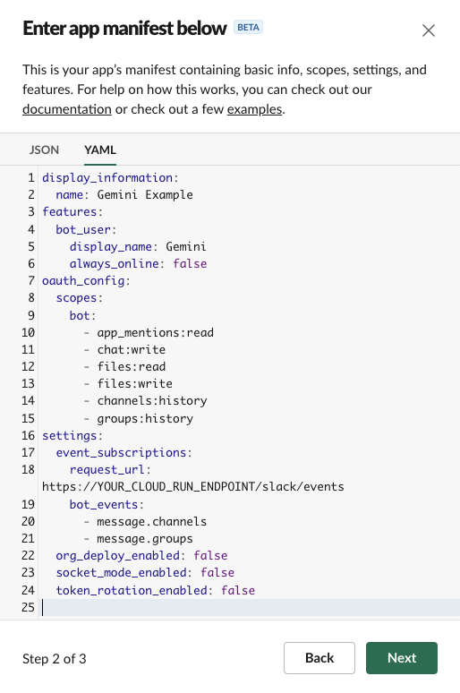
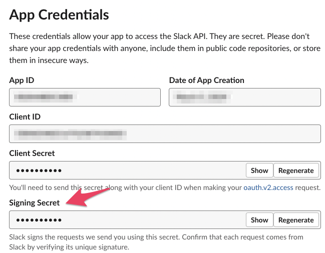
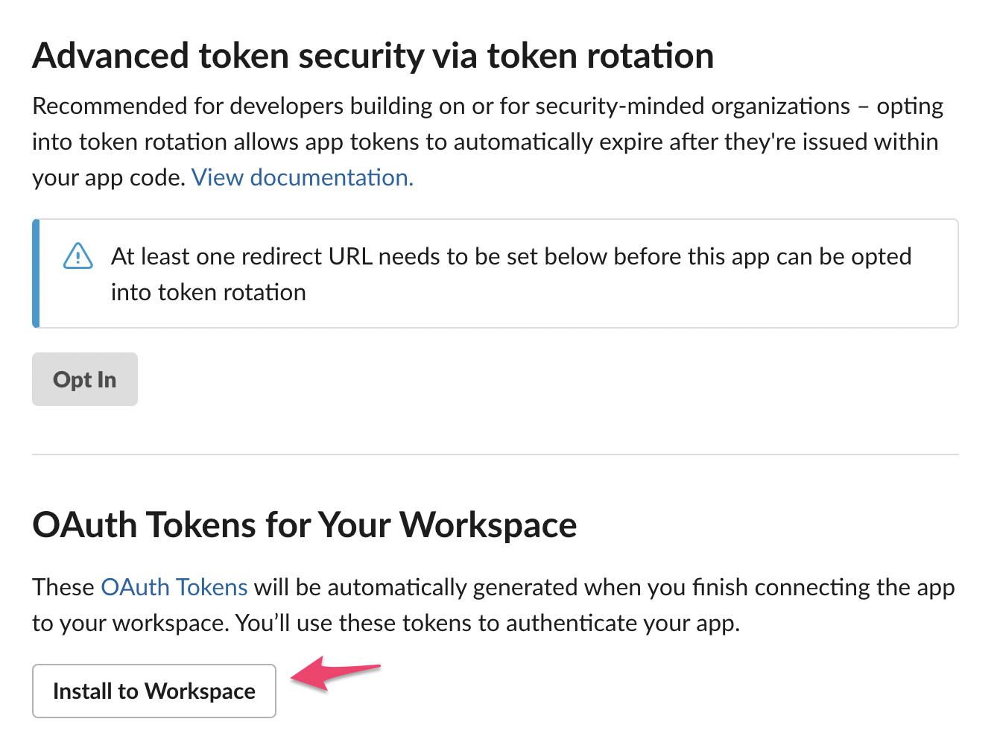
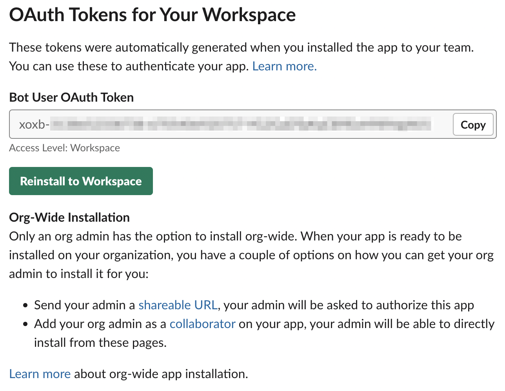
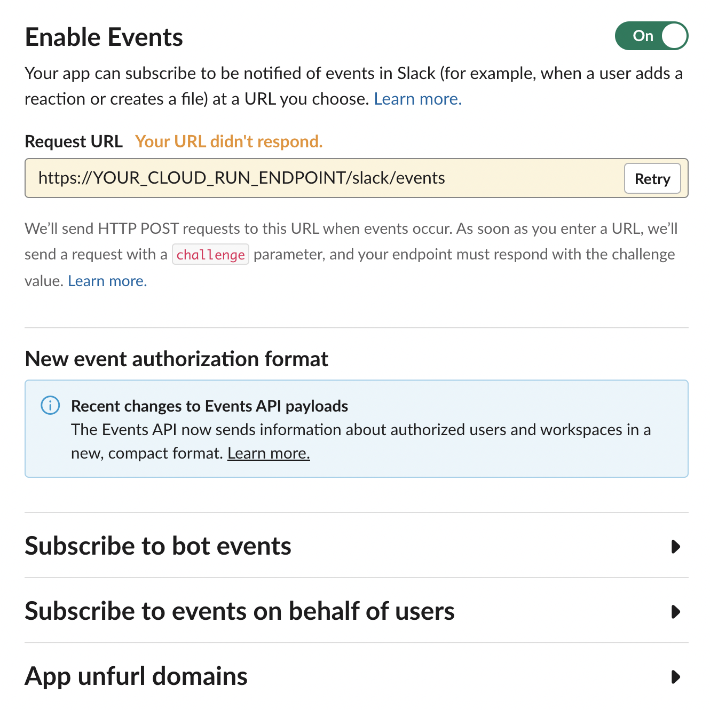

# Gemini slackbot example

This is Gemini Pro integrated slack (bolt JavaScript framework) sample app. Users can have a conversation with Gemini.


## deploy you're environment

### [deprecated] One Click Deploy Button

Cloud Run one click deploy button is deprecated...
Currently we are considering the next best deployment process.
Now just intractive shell script.

### deploy from your local

```sh
$ npm run deploy
```

Then intractive shell scripts are launched. Input followings

- Google Cloud Platform region
  - build and deploy target region
- Google Cloud Platform project name
  - target project ID not number
- Google Cloud service account for cloud run
- slack bot authentication
  1. slack signing secret
  2. slack oauth2 token for bot

## Google Cloud Service Account

only one Google Cloud Permission

- "aiplatform.endpoints.predict"

## Slack integration

### 1. Create slack app

- Go to [https://api.slack.com/apps](https://api.slack.com/apps)
- Click "Create New App" button
- Select "From an app manifest"
- Select target workspace
- Paste the slack app manifest from [slack.yaml](./slack.yaml)



### 2. Retrive slack authentications

#### a. slack signing secret

Go to the app page like "https://https://api.slack.com/apps/SLACK_APP_ID"



#### b. bot oauth2 token

Go to the auth page like "https://api.slack.com/apps/SLACK_APP_ID/oauth" and install the app your workspace.



After installing OAuth2 bot token will be appeared in the same page.



### 3. Set the event subscription URL

Replace "YOUR_CLOUD_RUN_ENDPOINT" after `npm run deploy`



## local development

```sh
$ SLACK_SIGNING_SECRET=YOUR_OWN_ONE \
  SLACK_OAUTH2_BOT_TOKEN=YOUR_OWN_ONE \
  SLACK_SOCKET_MODE=true \
  SLACK_APP_TOKEN=YOUR_OWN_ONE \
  GCP_PROJECT=YOUR_OWN_ONE \
  GCP_REGION=YOUR_OWN_ONE \
  npm run start:dev
```

## environment variables

### optional

- `LLM_MODEL` : "gemini" or "claude3"
